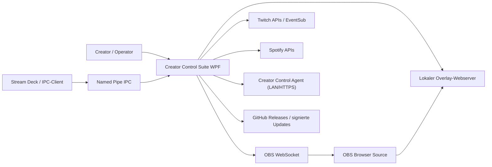
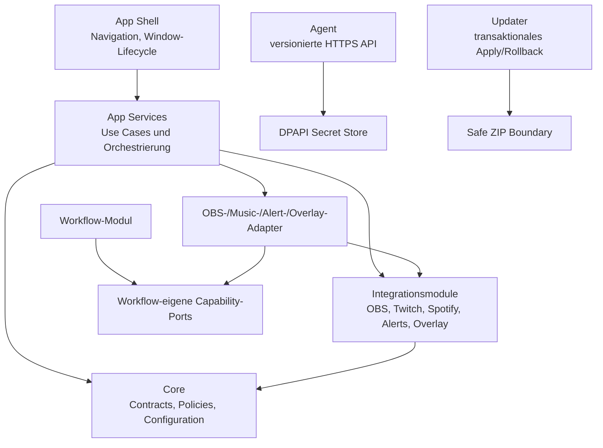

# Creator Control Suite 8.x – Ist- und Zielarchitektur

Stand: 28. Juli 2026

## Systemkontext

## Container und Verantwortungen

Die heutige Hauptschuld ist die Shell: `MainWindow.xaml.cs` bündelt UI,
Persistenz, Netzwerkzugriffe, Timer und Domänenorchestrierung. Sie wird
strangler-artig in vertikale Features zerlegt. Neue Features dürfen diese
Schuld nicht vergrößern.

Die Anwendung enthält keine kommerzielle Laufzeit-Lizenzierung mehr. Editionen,
Aktivierung, Lizenzserver und Feature-Gates wurden entfernt; alle Funktionen
und Themes sind verfügbar. Die Wahl einer Open-Source-Lizenz bleibt eine
rechtliche Repository-Entscheidung und ist kein Laufzeitdienst.

## Sicherheitsrelevante Datenflüsse

| Fluss | Geheimnisse | Schutzgrenze |
|---|---|---|
| OAuth Twitch/Spotify | Tokens, Client-Secrets | `ISecretStore`/DPAPI; keine Logs |
| App → Agent | Geräte-API-Key, OBS-Passwort | Nutzerbestätigtes TLS-Pinning, versionierte API, DPAPI |
| IPC → App | lokale Befehle | Named Pipe, Validierung, begrenzte Befehlsmenge |
| App → Overlay | Stream-/Chatdaten | Loopback/LAN-Konfiguration, Payload-Limits |
| Release → Updater | Manifest, ZIP | RSA-Signatur, SHA-256, sichere Extraktion |

## Zielgrenzen

- `MainWindow`: höchstens 500 Zeilen Code-behind.
- Seiten: eigene View, ViewModel und Anwendungsservice; XAML unter 1.000 Zeilen.
- `App.xaml.cs`: Composition Root und Lifecycle werden getrennt.
- Workflow verwendet nur Capability-Interfaces, keine konkreten Module.
- Modulregistrierung liegt beim jeweiligen Modul.
- Einstellungen behalten die JSON-Kompatibilität, erhalten aber Schema-Version
  und sequenzielle Migrationen.
- Die Konfigurationsmodelle sind nach General, OBS, Twitch, Music, Alerts,
  Overlay, Workflow, StreamDeck, Dashboard und Updates getrennt; `AppSettings`
  bleibt ausschließlich der kompatible Top-Level-Vertrag.
- Lang laufende Komponenten implementieren `IHostedService` oder einen
  äquivalent testbaren Lifecycle.
- Persistierte Einstellungen tragen eine Schema-Version und werden ausschließlich
  über sequenzielle, getestete Migrationen angehoben; Zukunftsschemas werden
  ohne stilles Downgrade abgelehnt.

## Verifikation

`ArchitectureGuardTests` blockiert neue/gesteigerte Größenschuld,
Core-Rückreferenzen, Referenzen von Modulen auf die App und die
Wiedereinführung kommerzieller Laufzeit-Lizenzierung. Bestehende
Überschreitungen sind als schrumpfende Baseline erfasst und dürfen nicht wachsen.
Der Named-Pipe-Vertrag wird als echter Client/Server-Roundtrip einschließlich
Fehlerisolation und Lifecycle getestet.
Der Spotify-Web-API-Vertrag wird gegen versionierte 2026-Fixtures geprüft:
Playback-Nullability, Bearer-Header, Paging, URL-Encoding, generische
Bibliotheksendpunkte und die Umbenennung von Playlist-`tracks` zu `items`.
Der Twitch-Helix-Vertrag wird analog über Fixtures für Pflicht-Header,
Benutzer-Mapping, Follower-Query, cursor-basiertes Chatter-Paging,
Chat-Drop-Reasons und Fehlerantworten abgesichert.
Der OBS-WebSocket-5.x-Vertrag wird über reale JSON-Frame-Fixtures für
Handshake, Authentifizierung, Request-Status und Events abgesichert. Ein
zentraler Codec validiert Envelope-Struktur und ein 4-MiB-Payload-Limit.
OBS-Transport, Twitch-API-Verträge und Spotify-Token-/Playback-Helfer liegen in
separaten Dateien; keine dieser Integrationsdateien überschreitet 1.000 Zeilen.
Das Größen-Gate umfasst auch die TypeScript-Produktionsquellen des Overlays.
Die frühere 1.232-zeilige Runtime-Sammlung ist in einen 719-zeiligen
Kompositionskern sowie eigenständige Chat- und Socials-Widgets zerlegt.
Canary-Steuerung, Fehlergrenze, Wartungsfenster und Agent-Transport für
Multi-PC-Updates liegen im testbaren `RemoteUpdateRolloutService` und nicht mehr
im Window-Code.
Die übrige Multi-PC-Oberfläche ist sichtbar als **Alpha** gekennzeichnet und
wird auf Produktentscheidung vorerst nicht weiter refaktoriert. Sie gehört
damit nicht zu den als stabil zugesagten Verkaufsfunktionen.
Legacy-Normalisierung und validierungsgeschützte Persistenz der Einstellungen
liegen im `SettingsApplicationService`; ungültige Einstellungen erreichen den
persistenten Store nicht.
Der lokale Updateablauf wird durch `UpdateWorkflowService` orchestriert:
Download, optionales Backup, Apply und Fortschrittsphasen sind unabhängig von
WPF testbar.
Der Settings-Tab hostet für lokale Updates eine eigene
`UpdateSettingsView` mit `UpdatePageViewModel`. Prüfung, Installation,
Backup-Liste und Restore-Zustand liegen damit nicht mehr in `MainWindow`.
Legacy-Erkennung und -Import liegen analog in `MigrationSettingsView` und
`MigrationPageViewModel`; die Shell stellt nur den Reload-Callback nach einem
erfolgreichen Import bereit.
Rechtliche Dokumente werden über `LegalSettingsView`,
`LegalPageViewModel` und den testbaren `ILegalDocumentLauncher` geöffnet; die
Shell kennt weder Dokumentpfade noch Prozessstart.
Allgemeine Angaben, Theme-Auswahl und Verbindungs-Watchdog liegen in
`GeneralSettingsView` und `GeneralSettingsPageViewModel`. Mapping,
Intervallgrenzen und Live-Themewechsel sind unabhängig von der Shell testbar.
Der Twitch-Ziele-Editor liegt in `TwitchGoalsView` und
`TwitchGoalsPageViewModel`. Settings-Mapping, Eingabenormalisierung und die
Übernahme der Live-Zähler sind damit unabhängig von WPF testbar; die
Overlay-Orchestrierung verbleibt bis zu einem späteren Slice in der Shell.
Die Spotify-Automatik liegt in `SpotifyAutomationView` und
`SpotifyAutomationPageViewModel`. Start-/Endmusik, Live-Lautstärke,
Alert-Ducking, Fade-Grenzen und Startplaylist werden dort normalisiert und
getestet; Wiedergabe und Spotify-API-Orchestrierung verbleiben zunächst in der
Shell.
Die Workflow-Sessionanzeige liegt in `WorkflowSessionView` und
`WorkflowSessionPageViewModel`. Status, Countdown und Sessionmetriken werden
ohne WPF-Abhängigkeit abgebildet; Reset und Viewer-Samples laufen über
testbare Commands und schmale Shell-Callbacks.
Webserver- und Chat-Einstellungen des Overlays liegen in
`OverlayConnectionSettingsView` und
`OverlayConnectionSettingsPageViewModel`. Portvalidierung,
Darstellungsnormalisierung, URL-Aktionen und Dateiauswahl sind damit vom
Canvas-/Extension-Pack-Lifecycle getrennt und unabhängig von WPF testbar.
Canvas-Liste, URLs und Benutzeraktionen liegen in `OverlayCanvasView` und
`OverlayCanvasPageViewModel`; `OverlayCanvasApplicationService` koordiniert
Layout-, Settings- und Webserver-Persistenz. Create und Duplicate rollen bei
einem fehlgeschlagenen Settings-Write zurück. Delete persistiert zuerst die
Metadaten und entfernt danach die Layoutdatei, damit kein gespeichertes Canvas
ohne Layout entsteht.
Extension-Pack-Katalog, Import und Deinstallation liegen in
`OverlayExtensionPacksView` und `OverlayExtensionPacksPageViewModel`.
Alert-Bibliothek und Definition-Lifecycle liegen in `AlertLibraryView`,
`AlertLibraryPageViewModel` und `AlertDefinitionApplicationService`.
Create, Duplicate, Enable/Disable und Delete werden unabhängig von WPF
persistiert und bei fehlgeschlagenem Settings-Write zurückgerollt. Das
`AlertDefinitionEditorViewModel` übernimmt Designer-Mapping, Normalisierung
und Validierung; MediaElement, Dateidialoge und die Laufzeitvorschau verbleiben
als Plattformadapter in der Shell.
`AlertRuntimeView` und `AlertRuntimePageViewModel` kapseln zusätzlich
Alert-Aktivierung,
Streamer.bot-Unterdrückung, OBS-Quellnamen, Zwischenpause und die Darstellung
des Queue-Zustands. Benutzeraktionen werden als Commands an schmale
OBS-/Streamer.bot-Plattformadapter delegiert; die View enthält keine
Geschäftslogik.
Die Stream-Statistik ist als `StatisticsPageView` und
`StatisticsPageViewModel` vollständig aus der Shell extrahiert.
`StreamStatisticsApplicationService` liest die JSONL-Historie fehlertolerant
und projiziert Kennzahlen, Kategorien sowie Verlauf ohne WPF-Abhängigkeit.
`MainWindow` stellt nur noch Historienpfad, Ordneröffnung und die
Dashboard-Kennzahl-Aktualisierung als Plattformcallbacks bereit.
Die Music-Player-Oberfläche liegt analog vollständig in
`MusicPlayerPageView`. `MusicPlayerPageActions` bildet die schmale Grenze für
Wiedergabe, Verbindung, Seek, Lautstärke sowie YouTube-Music-Bookmarklets.
Die Shell übergibt Zustände und Anwendungs-Callbacks, kennt aber keine
Steuerelemente oder Drag-and-drop-Details der Seite.
Die Workflow-Seite ist als `WorkflowPageView` aus der Shell gelöst und
vertikal in `RunOfShowView`, `TimedAutomationView`, `WorkflowDesignerView`
und `ShortStreamTestView` gegliedert. Der Seitenrahmen delegiert Prepare,
Countdown, Live, Pause, Resume und Ende über `WorkflowPageActions`.
Die umfangreichen Regieplan- und Automationseingaben bleiben während der
Strangler-Migration über explizite Komponentenhosts kompatibel und werden
anschließend in eigene ViewModels und Anwendungsservices überführt.
Die zugehörigen Legacy-Orchestrierungen sind bis dahin physisch in
`MainWindow.Workflow.RunOfShow.cs`,
`MainWindow.Workflow.AutomationEditor.cs` und
`MainWindow.Workflow.Designer.cs` begrenzt. Keine dieser Partial-Dateien
überschreitet 1.000 Zeilen; sie bilden ausdrücklich keine endgültige
Domänengrenze.
Die Einstellungen-Seite wird durch `SettingsPageView` gehostet. Sie komponiert
die bereits extrahierten General-, Legal-, Update- und Migration-Views und
kapselt Save, Status und Tabnavigation. Die verbleibende kompatible
Load-/Migrations-/Save-Orchestrierung liegt in
`MainWindow.Settings.Persistence.cs` unterhalb des 1.000-Zeilen-Gates; die
fachlichen Settings-Modelle und Migrationen bleiben in ihren vorhandenen
testbaren Services.
Die Dienste-Seite ist über `ServicesPageView` nach Integrationsgrenzen
gegliedert: Spotify, Twitch, OBS, Streamer.bot und Stream Deck besitzen eigene
Views. Die Host-View verantwortet ausschließlich Übersicht und Navigation.
Der umfangreiche Legacy-Code für Stream-Deck-Katalog/Runtime und
Regelverwaltung liegt vor der weiteren Service-Migration in zwei
Partial-Dateien unterhalb des 1.000-Zeilen-Gates.
Auch die verbleibende Shell-Orchestrierung für Twitch, Spotify und OBS ist
nach Integrations- und Ablaufgrenzen in begrenzte Partial-Dateien unter
`Shell/Services/` verschoben. Twitch trennt Dashboard/Raid, Engagement und
API/Professional; Spotify trennt Verbindung, Katalog/Geräte, Runtime-Overlay,
Sichtbarkeit, Overlay-Einstellungen und Saved-State-Lifecycle; OBS trennt
Verbindung/Dashboard, Streamstart, Streamende und Service-Steuerung. Keine
dieser Dateien überschreitet 1.000 Zeilen. Ein Architekturtest verhindert,
dass die extrahierten Einstiegsmethoden wieder in `MainWindow.xaml.cs`
zurückwandern.
Streamer.bot und Creator Intelligence besitzen ebenfalls eigene
Integrations-Partials. Diagnose/Logs, Alert-Editor, Music-Runtime,
Overlay-Runtime/Extensions und Dashboard-Runtime/Verbindungen sind als
separate Shell-Slices organisiert. Workflow-Vorbereitung und die
Timed-Automation-Runtime liegen neben den bereits extrahierten
Workflow-Editor-Partials. Diese Dateien sind weiterhin Strangler-Grenzen:
UI-unabhängige Fachlogik wird in den folgenden Schritten aus ihnen in
Anwendungsservices verschoben.
Das Konstruktor-Wiring ist nach Dashboard, Diagnose, OBS, Twitch, Spotify,
Services, Workflow und Stream Deck in Initializer-Partials aufgeteilt.
Navigation, Window-Lifecycle, Release-Readiness und Dashboard-Layout liegen
ebenfalls außerhalb der Hauptdatei. Die bestehende Multi-PC-Alpha-Logik wurde
ohne Verhaltensänderung in zwei begrenzte Partials verschoben.
Das Command-Center-Dashboard liegt vollständig in `DashboardPageView`.
`MainWindow.xaml` enthält nur noch Shell, Navigation und Seitenhosts und
unterschreitet mit 943 Zeilen erstmals das allgemeine 1.000-Zeilen-Gate.
Für die Shell-XAML existiert daher keine Legacy-Größenbaseline mehr.
`MainWindow.xaml.cs` liegt mit 495 Zeilen erstmals unter dem Zielwert von
500 Zeilen. Architekturtests blockieren sowohl ein erneutes Wachstum als
auch neue Partial-Dateien ab 1.000 Zeilen.
Der Agent-Composition-Root liegt unter 1.000 Zeilen; Hosting, Discovery und
Datei-/Update-Helfer sind in `AgentUtilities` isoliert.
