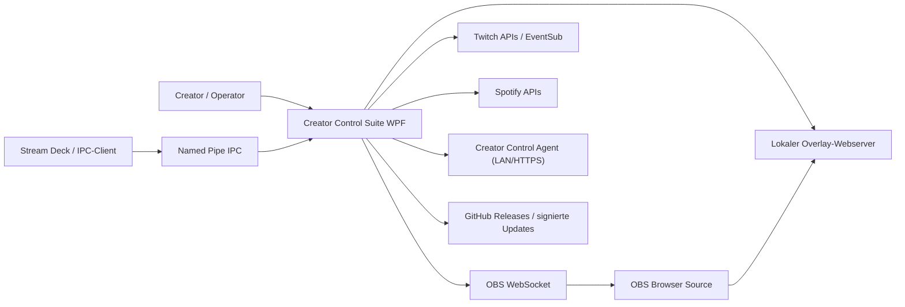
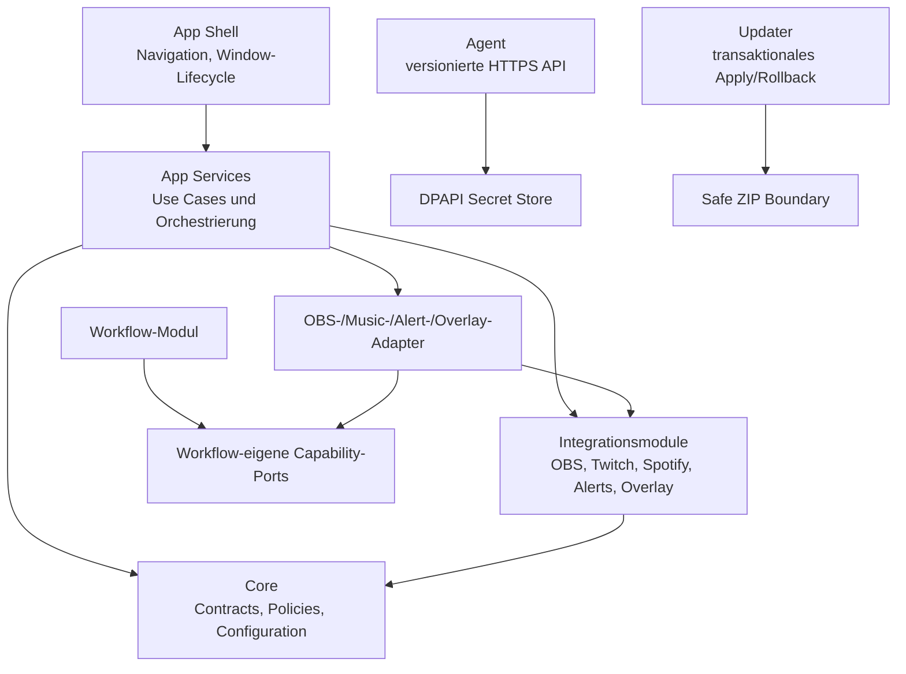

# Creator Control Suite 8.x – Ist- und Zielarchitektur

Stand: 28. Juli 2026

## Systemkontext

## Container und Verantwortungen

Die heutige Hauptschuld ist die Shell: `MainWindow.xaml.cs` bündelt UI,
Persistenz, Netzwerkzugriffe, Timer und Domänenorchestrierung. Sie wird
strangler-artig in vertikale Features zerlegt. Neue Features dürfen diese
Schuld nicht vergrößern.

## Sicherheitsrelevante Datenflüsse

| Fluss | Geheimnisse | Schutzgrenze |
|---|---|---|
| OAuth Twitch/Spotify | Tokens, Client-Secrets | `ISecretStore`/DPAPI; keine Logs |
| App → Agent | Geräte-API-Key, OBS-Passwort | Nutzerbestätigtes TLS-Pinning, versionierte API, DPAPI |
| IPC → App | lokale Befehle | Named Pipe, Validierung, begrenzte Befehlsmenge |
| App → Overlay | Stream-/Chatdaten | Loopback/LAN-Konfiguration, Payload-Limits |
| Release → Updater | Manifest, ZIP | RSA-Signatur, SHA-256, sichere Extraktion |

## Zielgrenzen

- `MainWindow`: höchstens 500 Zeilen Code-behind.
- Seiten: eigene View, ViewModel und Anwendungsservice; XAML unter 1.000 Zeilen.
- `App.xaml.cs`: Composition Root und Lifecycle werden getrennt.
- Workflow verwendet nur Capability-Interfaces, keine konkreten Module.
- Modulregistrierung liegt beim jeweiligen Modul.
- Einstellungen behalten die JSON-Kompatibilität, erhalten aber Schema-Version
  und sequenzielle Migrationen.
- Die Konfigurationsmodelle sind nach General, OBS, Twitch, Music, Alerts,
  Overlay, Workflow, StreamDeck, Dashboard und Updates getrennt; `AppSettings`
  bleibt ausschließlich der kompatible Top-Level-Vertrag.
- Lang laufende Komponenten implementieren `IHostedService` oder einen
  äquivalent testbaren Lifecycle.
- Persistierte Einstellungen tragen eine Schema-Version und werden ausschließlich
  über sequenzielle, getestete Migrationen angehoben; Zukunftsschemas werden
  ohne stilles Downgrade abgelehnt.

## Verifikation

`ArchitectureGuardTests` blockiert neue/gesteigerte Größenschuld,
Core-Rückreferenzen und Referenzen von Modulen auf die App. Bestehende
Überschreitungen sind als schrumpfende Baseline erfasst und dürfen nicht wachsen.
OBS-Transport, Twitch-API-Verträge und Spotify-Token-/Playback-Helfer liegen in
separaten Dateien; keine dieser Integrationsdateien überschreitet 1.000 Zeilen.
Canary-Steuerung, Fehlergrenze, Wartungsfenster und Agent-Transport für
Multi-PC-Updates liegen im testbaren `RemoteUpdateRolloutService` und nicht mehr
im Window-Code.
Legacy-Normalisierung und validierungsgeschützte Persistenz der Einstellungen
liegen im `SettingsApplicationService`; ungültige Einstellungen erreichen den
persistenten Store nicht.
Der lokale Updateablauf wird durch `UpdateWorkflowService` orchestriert:
Download, optionales Backup, Apply und Fortschrittsphasen sind unabhängig von
WPF testbar.
Der Agent-Composition-Root liegt unter 1.000 Zeilen; Hosting, Discovery und
Datei-/Update-Helfer sind in `AgentUtilities` isoliert.
